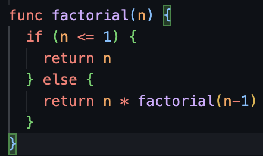

# Miller DSL Syntax Highlighting for Visual Studio Code

[@johnkerl](https://github.com/johnkerl)'s outstanding tool [Miller](https://github.com/johnkerl/miller) ships with syntax highlighting support for Vim. This project, essentially a port of the [Vim syntax file](https://github.com/johnkerl/miller/blob/main/vim/syntax/mlr.vim), adds [Miller DSL](https://miller.readthedocs.io/en/latest/miller-programming-language/) syntax highlighting to Visual Studio Code.

The factorial example from the [Miller DSL intro](https://miller.readthedocs.io/en/latest/miller-programming-language/#functions-and-local-variables):

The extension is available on the [VSCode Marketplace](https://marketplace.visualstudio.com/).
